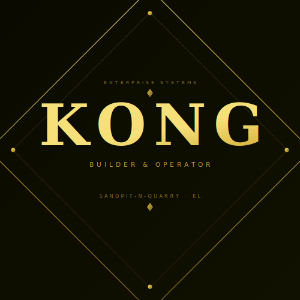

<div align="center">

<!-- KKB LUXURY SVG MONOGRAM LOGO -->


<br/>

<!-- LUXURY GOLD HERO BANNER -->


<!-- LUXURY TYPING LINE -->


<br/>

<!-- GOLD DIVIDER -->


<br/><br/>

<!-- LUXURY BADGES -->
[](https://github.com/KongBuilder)
[](https://github.com/KongBuilder)
[](https://github.com/Sandpit-n-Quarry)

</div>

---

## 👑 Identity

```typescript
const KONG = {
  displayName  : "Kong · Builder & Operator",
  handle       : "@KongBuilder",
  location     : "Kuala Lumpur, Malaysia 🇲🇾",
  organization : "Sandpit-n-Quarry  |  iQuarry",

  currentlyBuilding : [
    "terraflow-system        →  Quarry & earth-works ERP",
    "quarryxpress            →  Automated invoicing & dispatch",
    "transit-pal-kl          →  KL logistics tracking platform",
    "transport-hub           →  Centralized transport management",
  ],

  stack        : ["TypeScript", "React", "Next.js", "Node.js", "Python", "GCP", "Supabase"],

  mission      : "Digitizing industries that still run on paper.",
  philosophy   : "Build for the real world. Ship. Operate. Repeat."
};
```

---

## ♦️ What I Build

<div align="center">

| &nbsp; | Domain | Impact |
|--------|--------|--------|
| 🏗️ | **Quarry & Earth-Works ERP** | Modernizing a RM-billion industry still on paper |
| 🚚 | **Logistics & Fleet Management** | Real-time ops visibility for fleet operators |
| 🧾 | **Finance & Invoice Automation** | Cutting manual billing work by 80%+ |
| 🌐 | **Full-Stack SaaS Platforms** | Clean enterprise UX on complex business logic |
| 🤖 | **AI & Automation Systems** | LLMs doing real business work, not demos |

</div>

---

## ⚔️ Tech Arsenal

<div align="center">

**Languages**


**Frontend**


**Backend & Cloud**


</div>

---

## 📌 Flagship Projects

<div align="center">

[](https://github.com/KongBuilder/terraflow-system)
[](https://github.com/KongBuilder/transit-pal-kl)

[](https://github.com/KongBuilder/quarryxpress-invoice-flow)
[](https://github.com/KongBuilder/transport-hub)

</div>

---

## 📊 Stats

<div align="center">


<br/>

[](https://git.io/streak-stats)

</div>

---

## 🏆 Trophies

<div align="center">

[](https://github.com/ryo-ma/github-profile-trophy)

</div>

---

## 📈 Activity


---

<div align="center">


<br/>

[](https://github.com/KongBuilder)
[](https://github.com/Sandpit-n-Quarry)
[](https://maps.google.com/?q=Kuala+Lumpur)

<br/>

> *"♦️ Digitizing industries. Building systems. Operating at scale. ♦️"*

<br/>


<br/>

</div>


